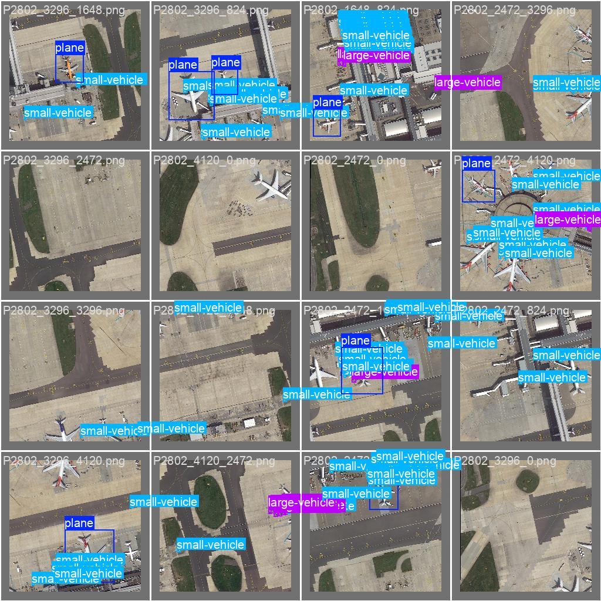
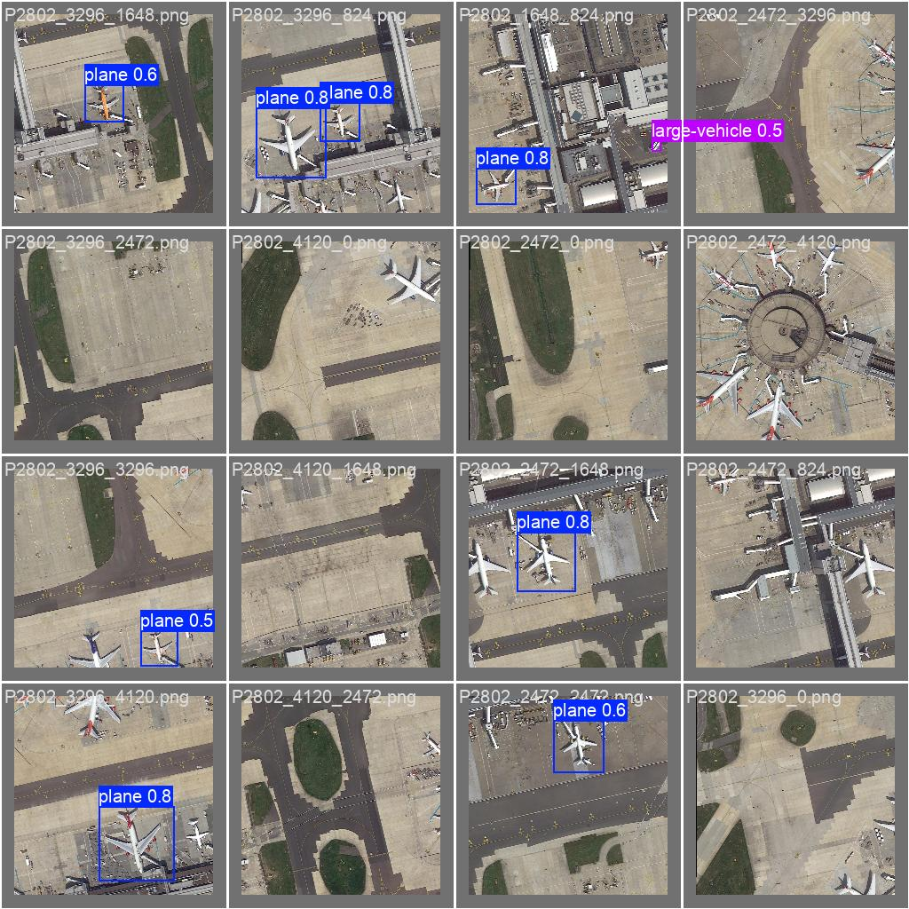
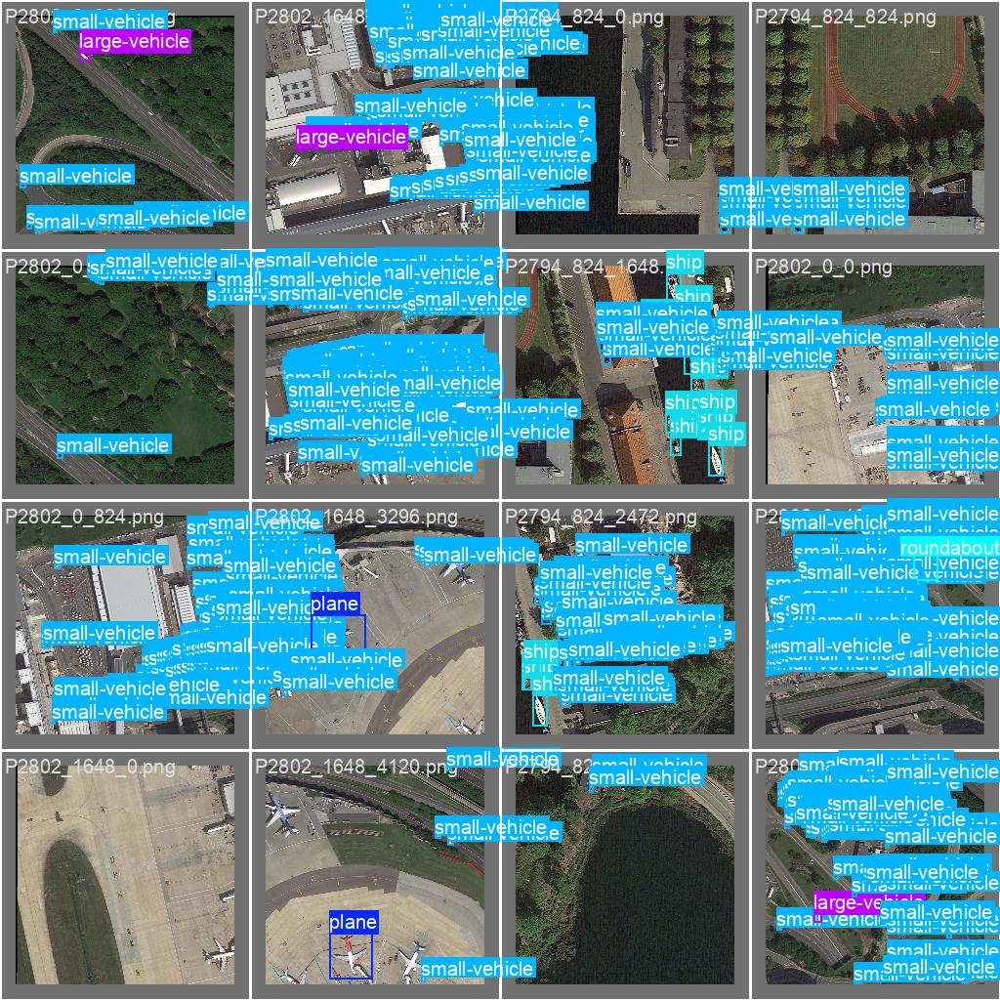
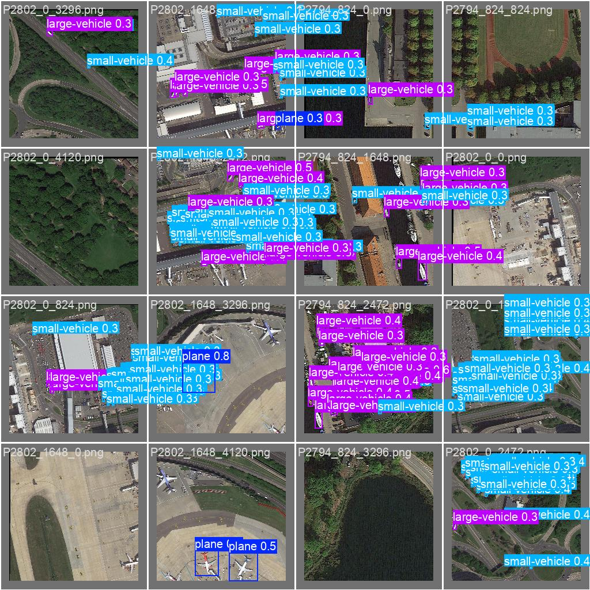
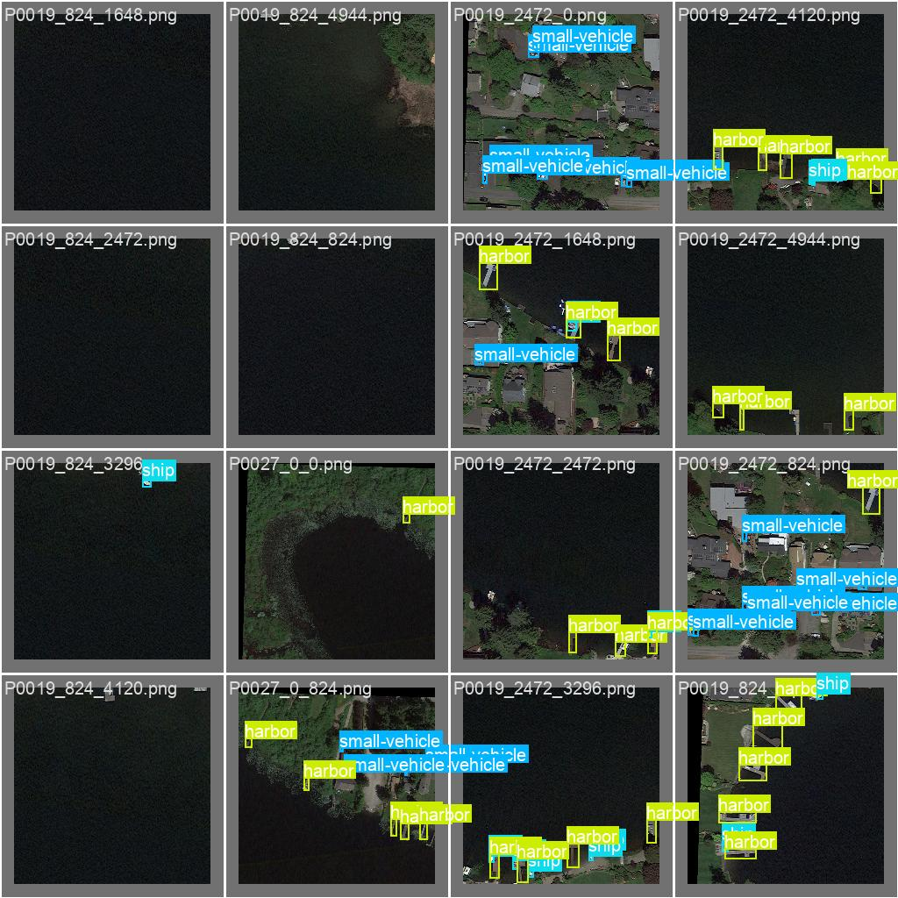
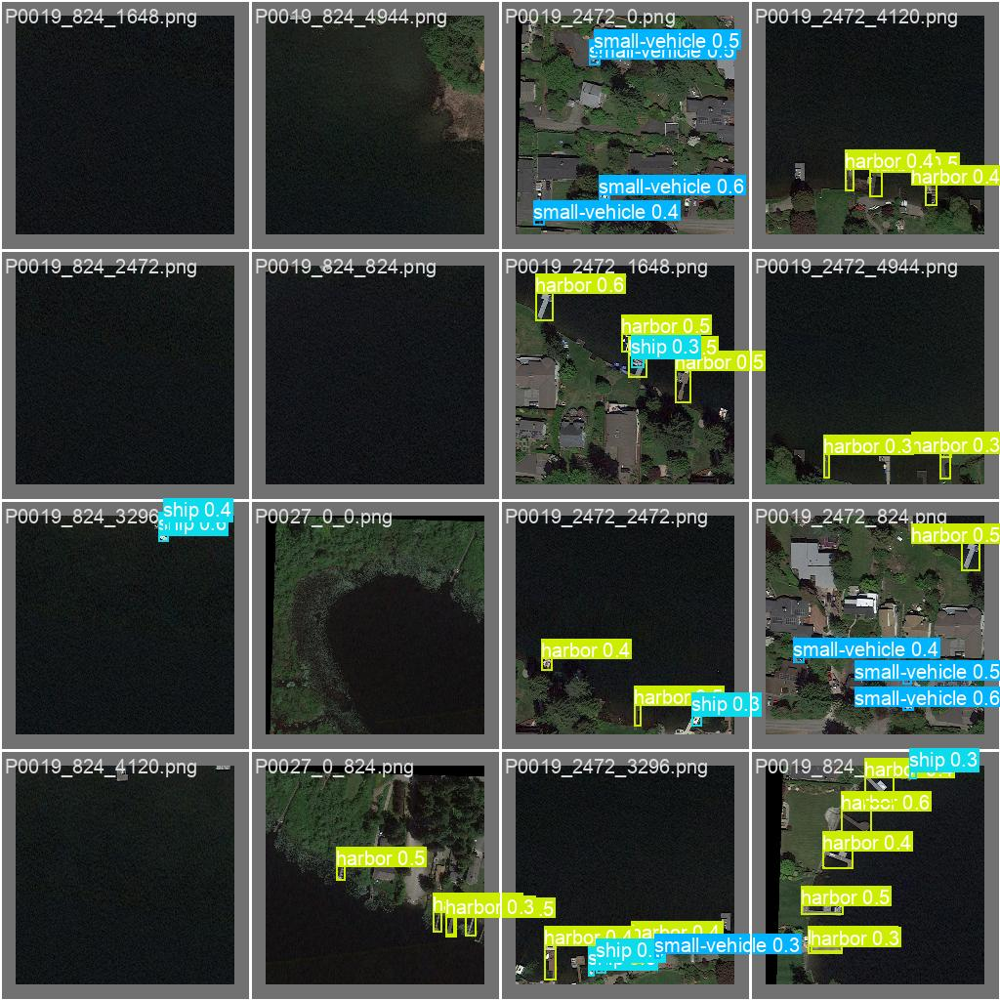

# Locate-Aware Pretraining for Small Object Detection in Remote Sensing

## Key Idea
Use location-aware pretraining to guide feature learning, improving small object detection performance in remote sensing.

- During pretraining, instead of random masking, we select masked patches guided by ground-truth object locations.
- The model predicts the **latent feature embeddings** (not raw pixels) of the masked regions.
- This may encourage the model to focus on learning representations that are **semantically aligned** with objects.
- In the first experiment, a ViT architecture was trained with a **Joint-Embedding Predictive Architecture (JEPA)** objective.

---

## Workflow
**基于目标区域生成掩码 → 预测掩盖部分的特征 → 最小化特征损失 → 迁移到目标检测模型**

### Pseudocode
```python
# Inputs:
#   img: input image (size H×W)
#   gt_boxes: ground-truth bounding boxes

# Step 1: Object-aware Masking
mask = generate_object_mask(gt_boxes, patch_size=16, mask_ratio=0.75)

# Step 2: Encode Full Image (Target Encoder)
with no_grad():
    z_target = target_encoder(img)  # output latent features

# Step 3: Encode Masked Image (Context Encoder)
img_masked = apply_mask_to_image(img, mask)
z_context = context_encoder(img_masked)

# Step 4: Predict Features
z_pred = predictor(z_context)

# Step 5: Compute Loss
loss = mean_squared_error(z_pred[mask], z_target[mask])

# Step 6: Backpropagation
optimizer.zero_grad()
loss.backward()
optimizer.step()

# Step 7: Fine-tuning
# After pretraining, transfer the context_encoder as the detection backbone
```

---

## Difference with MAE

| Aspect             | Object-Aware JEPA                            | MAE (Masked Autoencoder)                  |
|--------------------|----------------------------------------------|-------------------------------------------|
| Masking strategy    | Object-aware masking                        | Random masking                            |
| Prediction target   | Latent features (ViT embeddings)            | Pixel values (RGB reconstruction)         |
| Focus               | Predict latent features at masked object locations | Reconstruct all patches equally  |
| Task alignment      | Stronger for detection tasks (semantic alignment) | Stronger for general image reconstruction |
| Loss function       | L2 loss between features                    | L2 loss between pixels                    |

---

## First Test Results (50 Epochs)

| Class               | #GT   | #Pred  | Precision | Recall | mAP50 | mAP50-95 |
|---------------------|-------|--------|-----------|--------|-------|----------|
| All                 | 2985  | 61930  | 0.522     | 0.345  | 0.336 | 0.172    |
| Plane               | 320   | 2289   | 0.806     | 0.784  | 0.824 | 0.516    |
| Ship                | 420   | 8226   | 0.645     | 0.488  | 0.503 | 0.204    |
| Storage-tank        | 170   | 3064   | 0.816     | 0.244  | 0.326 | 0.166    |
| Baseball-diamond    | 88    | 170    | 0.490     | 0.379  | 0.363 | 0.184    |
| Tennis-court        | 56    | 226    | 0.495     | 0.646  | 0.639 | 0.466    |
| Basketball-court    | 42    | 116    | 0.406     | 0.103  | 0.0955 | 0.0599  |
| Ground-track-field  | 82    | 101    | 0.316     | 0.267  | 0.230 | 0.112    |
| Harbor              | 206   | 1452   | 0.529     | 0.597  | 0.559 | 0.235    |
| Bridge              | 217   | 419    | 0.458     | 0.115  | 0.128 | 0.0424   |
| Large-vehicle       | 324   | 2880   | 0.402     | 0.490  | 0.408 | 0.202    |
| Small-vehicle       | 715   | 42239  | 0.480     | 0.0581 | 0.0929 | 0.0272  |
| Helicopter          | 22    | 41     | 0.0779    | 0.244  | 0.0602 | 0.0188  |
| Roundabout          | 128   | 175    | 0.645     | 0.0971 | 0.128 | 0.0618   |
| Soccer-ball-field   | 71    | 91     | 0.515     | 0.268  | 0.211 | 0.117    |
| Swimming-pool       | 87    | 441    | 0.751     | 0.388  | 0.467 | 0.166    |


## Experiment Results

Labels and Predictions

#### Example 1
- **Labels 1**  
  

- **Prediction 1**  
  

#### Example 2
- **Labels 2**  
  

- **Prediction 2**  
  

#### Example 3
- **Labels 3**  
  

- **Prediction 3**  
  
